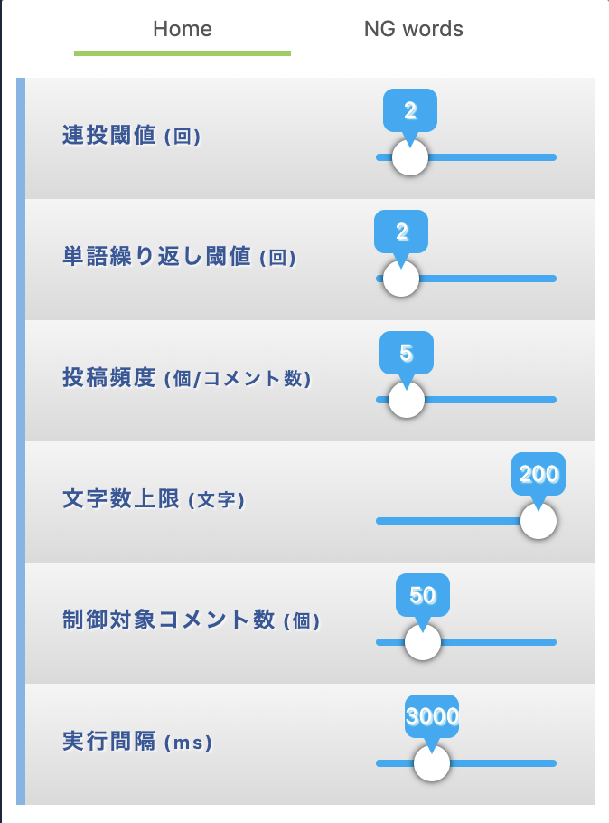
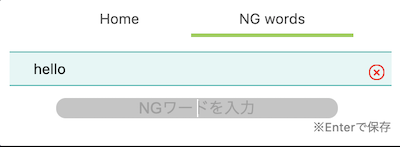
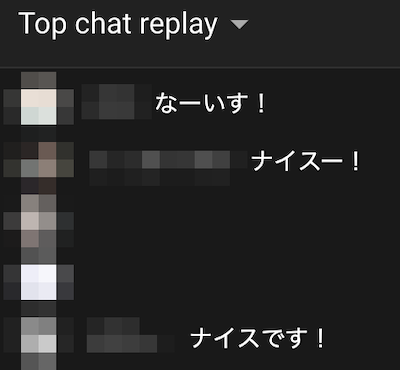

# modekun dash
**～取扱説明書 兼 設計仕様書～**  


# システム概要 <a name="aSystemSummary"></a>
Youtube Liveチャットのフィルターをおこなうブラウザ拡張modです。  
  
なお本ソースはオリジナルの「modekun」を少し機能変更してます。  
オリジナルの詳細は、オリジナルのリポジトリを参照ください。（以下謝辞に掲載）  


# 目次 <a name="aMokuji"></a>
* [システム概要](#aSystemSummary)
* [前提](#aPremise)
* [セットアップ手順](#aSetup)
* [起動方法](#aStart)
* [アップデート手順](#aUpdate)
* [運用方法](#aHowtoUnyou)
* [機能説明](#aFunction)
* [本リポジトリの規約](#aRules)
* [参考記事](#aReference)
* [謝辞](#aAcknowledgments)


# 前提 <a name="aPremise"></a>
* nodejs
* npm


# 環境セットアップ（for Windows） <a name="aSetup"></a>
Windows版のnode.jsを使用します。  

* 1.インストーラーのダウンロード  
  下記サイトからインストーラーをダウンロードします。  
    [nodejs](http://nodejs.org/)
  
  Download > Windows Installer をクリックするとカレントバージョンの自身のPCに合わせたインストーラーがダウンロードされます。  
  明示的に、32bit版、64bit版、バイナリ版など指定したい場合は、それぞれの項目をクリックするとダウンロードが開始します。  

* 2.msiセットアップを起動します  
  セットアップに従ってインストールします。  
  基本デフォルトのままで問題ありません。  

* 3.動作を確認します  

コマンドプロンプトから下記のコマンドを実行して、nodejs、nmpの動作を確認します。  
各コマンドでバージョンが表示されれば問題ありません。  

```
node --version
[バージョン]

npm --version
[バージョン]
```

* 4.Windowsのシステムの変更をおこないます  
  nodejs、nmp実行時のエラー回避のため、パスを通す作業です。  
  これをおこなわないと、*.cmdの実行に支障があるそうです。  
  
  * 1.コントロールパネルのシステムを開く  
  * 2.システムの詳細設定を開く  
  * 3.環境変数画面で、下段の「PATHEXT」の編集で末尾に ;.cmd を追記  
  * 4.OKを押して、開いた全てのウィンドウを閉じる  


npm install

npm run build

npm run watch


## Usage
Now, modekun can be used only in Youtube and Mildom, and only Japanese.

- moderate
  - repeat post 
  - repeat word in a chat
  - NG word
  - post frequency
  - limit length
  
popup looks like this





chats are hidden automatically



### repeat post 
repeat post threshold (連投閾値) can control how many chats posted by the same user should not be hidden.
  
#### example
```
user A: こんにちは
user A: こんにちは
user A: こんにちは
user B: こんにちは
user B: こんにちは
```
If `repeat post threshold = 3`, chats posted by user A will be hidden. 

### repeat word in a chat
repeat word in a chat (単語繰り返し閾値) can control how many words shown in a chat should not be hidden.

#### example
```
user A: 最強最強最強
user B: こんにちは
```
If `repeat word in a chat = 2`, chats posted by user A will be hidden.

### NG word
```
user A: こんにちは
user A: こん
user B: ハロー
```
If `NG word = こん`, chats posted by user A will be hidden.

### post frequency
post frequency(投稿頻度) can control how many posts by the same user in obtained chats.
```
user A: abc
user A: def
user B: こんにちは
```
If `post frequency threshold = 2`, chats posted by user A will be hidden.

### limit length
limit length(文字数上限) can control maximum the length of a chat.
```
user A: abcdefghi...z
user B: こんにちは
```
If `limit length = 10`, chats posted by user A will be hidden.

## Prerequisites

* [node + npm](https://nodejs.org/) (Current Version)

## Setup

```
npm install
```

## Build

```
npm run build
```

## Build in watch mode

### terminal

```
npm run watch
```

## Load extension to chrome

Load `dist` directory

## Test
`npx jest` or `npm run test`


# 本リポジトリの規約 <a name="aRules"></a>
* 素材の改造、流用、配布について。  
  このリポジトリ配下のソースの改造、改造物の配布、クローンは禁止とします。  
  が、フリーウェア規約には準拠します。  
* 著作権について。
  * このソースはfork流用ですので、当方改造部分の著作権は放棄しません。
  * 別に著作権表記のある素材の利用については、各自で許諾を取得ください。  
    当方では責任を負いません。  
* 免責事項について。
  * 当ソースを使用したことによる不具合、損害について当方は責任を持ちません。  
    全て自己責任でお願いします。  
  * Web上やSNS上、オンライン上で発生した、わたしが関知していないトラブル、損害については、  
    一切責任を負いません。各自でご対応をお願いします。  
* 当ソースの仕様、不具合についての質問は受け付けません。自己解析、自己対応でお願いします。  
  * fork元開発者へ、当リポジトリについてのお問い合わせをすることは  
    先方にご迷惑となりますので、やめてください。  
* このリポジトリに含まれるファイル構成を変えたり、消したりしないでください。誤動作の原因となります。  
* その他、ご意見、ご要望については、開発者ホームページを参照ください。  


# 参考記事 <a name="aReference"></a>
**※敬称略**  
* [Node.js / npmをインストールする（for Windows）](https://qiita.com/taiponrock/items/9001ae194571feb63a5e)


# 謝辞 <a name="aAcknowledgments"></a>
**※敬称略**  
* [momochi29（for fork souse master）](https://github.com/tjmtmmnk)  
  source : [https://github.com/tjmtmmnk/modekun](https://github.com/tjmtmmnk/modekun)


***
::Project= Korei bot  
::Admin= Korei (@korei-xlix)  
::github= https://github.com/korei-xlix/  
::Homepage= https://koreixlix.wixsite.com/profile  
